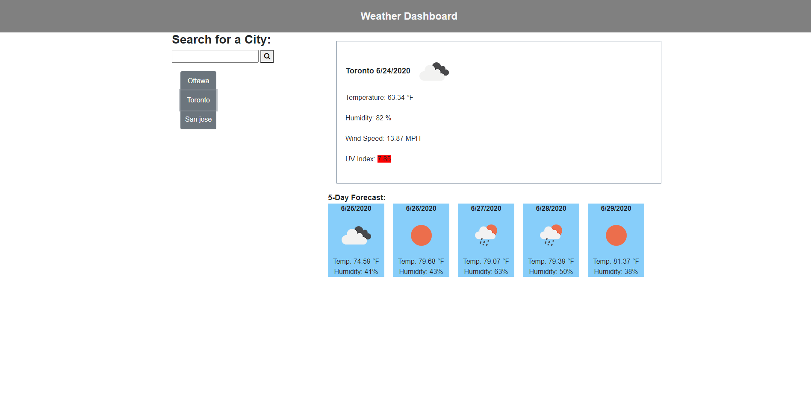

# Weather Dashboard

This app (https://kambiz-frounchi.github.io/homework-6/) is a weather dashboard that will run in the browser. It shows the current weather and five day forecast of the city the user is searching for. It also keeps a history of the already searched cities for convenient user access. When opening the weather dashboard, it presents the last searched city forecast.

In terms of the implementation, it uses the [OpenWeather API](https://openweathermap.org/api) to retrieve weather data for cities. Three API are used, one for retrieving current weather, one for the five day forecast and one for the UV index (as the current weather API does not return the UV index).  Once the weather info is retrieved, the required HTML elements are dynamically created along with their styling attributes. jQuery is used to facilitate DOM manipulation and also for making AJAX calls. [Moment API](https://momentjs.com/) is used for Date display and manipulation. Bootsrap is used for the styling framework. For persistance, local browser storage is used.

The following image demonstrates the application functionality:



Here are the user story and acceptance criteria:

## User Story

```
AS A traveler
I WANT to see the weather outlook for multiple cities
SO THAT I can plan a trip accordingly
```

## Acceptance Criteria

```
GIVEN a weather dashboard with form inputs
WHEN I search for a city
THEN I am presented with current and future conditions for that city and that city is added to the search history
WHEN I view current weather conditions for that city
THEN I am presented with the city name, the date, an icon representation of weather conditions, the temperature, the humidity, the wind speed, and the UV index
WHEN I view the UV index
THEN I am presented with a color that indicates whether the conditions are favorable, moderate, or severe
WHEN I view future weather conditions for that city
THEN I am presented with a 5-day forecast that displays the date, an icon representation of weather conditions, the temperature, and the humidity
WHEN I click on a city in the search history
THEN I am again presented with current and future conditions for that city
WHEN I open the weather dashboard
THEN I am presented with the last searched city forecast
```